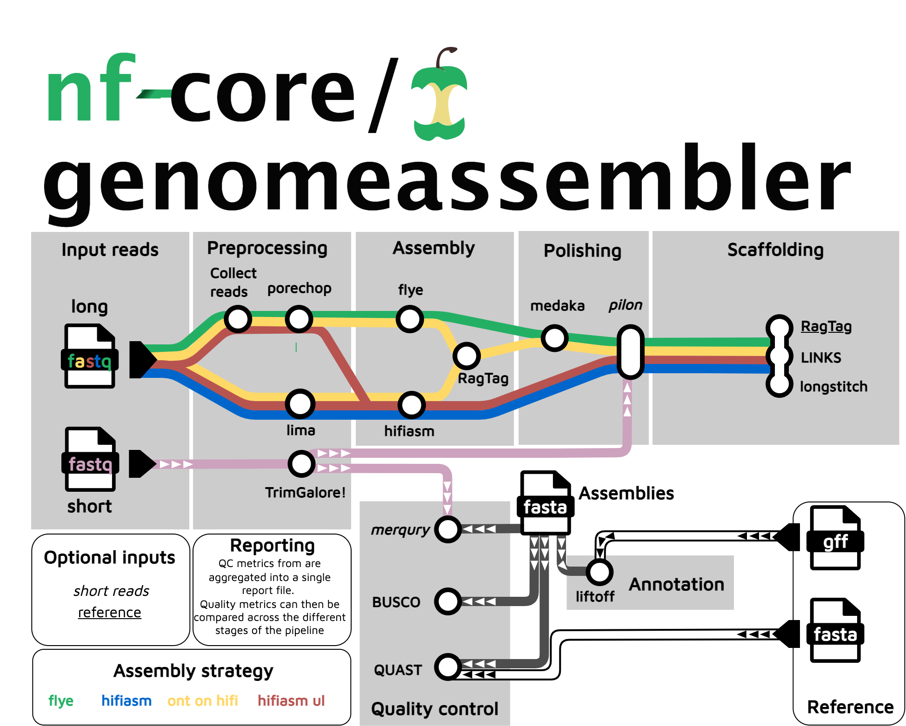

# nf-core/genomeassembler: Usage

## :warning: Please read this documentation on the nf-core website: [https://nf-co.re/genomeassembler/usage](https://nf-co.re/genomeassembler/usage)

> _Documentation of pipeline parameters is generated automatically from the pipeline schema and can no longer be found in markdown files._

## Introduction

This pipeline is designed to assemble haploid (or diploid inbred) genomes from long-reads. `nf-core/genomeassembler` can take ONT and HiFi reads, and supports different assembly strategies. The pipeline can also integrate information on a reference genome (e.g. closely related individual) and short-reads for quality control.
This pipeline can perform assembly, polishing, scaffolding and annotation lift-over from a reference genome. Phasing or HiC scaffolding are currently unsupported.



### Pre-set profiles

To ease configuration, there are a couple of pre-defined profiles for various combinations of read sources and assemblers (named readtype_assembler)

| ONT | HiFI  | Assembly-strategy                                  | Profile name          |
| --- | ----- | -------------------------------------------------- | --------------------- |
| Yes | No    | flye                                               | `ont_flye`            |
| No  | Yes   | flye                                               | `hifi_flye`           |
| No  | Yes   | hifiasm                                            | `hifi_hifiasm`        |
| Yes | Yes   | hifiasm --ul                                       | `hifiont_hifiasm`     |
| Yes | Yes   | Scaffolding of ONT assemblies onto HiFi assemblies | `hifiont_flyehifiasm` |

## Samplesheet input

You will need to create a samplesheet with information about the samples you would like to analyse before running the pipeline. Use the `input` parameter to specify its location:

```console
--input samplesheet.csv
```

### Samplesheet layout

The largest samplesheet format is:

```csv title="samplesheet.csv"
sample,ontreads,hifireads,ref_fasta,ref_gff,shortreads_F,shortreads_R,paired
Sample1,sample1ont.fq.gz,sample1hifi.fq.gz,ref.fa,ref.gff,sample1_r1.fq.gz,sample1_r2,fq.gz
```

The samplesheet _must_ contain a column name `sample` [string].
Further columns _can_ be:

- `ontreads` [path] for long reads produced with oxford nanopore sequencers
- `hifireads` [path] for long reads produced with pacbio sequencers in "HiFi" mode
- Reference information:
  - `ref_fasta` [path] fasta file of a reference genome
  - `ref_gff` [path] annotations of the reference genome in gff format
- Short reads
  - `shortreads_F` : shortread forward file
  - `shortreads_R`: shortread reverse file (paired end)
  - `paired`: [true/false] true if the reads are paired end, false if they are single-end. The `shortreads_R` column should exist if `paired` is `false` but can be empty.

### Multiple runs of the same sample

For ONT reads, a folder containing several fastq files can be provided, which will be concatenated into a single file if `--collect` is used. Generally we recommend to provide all reads in a single file.

## Running the pipeline

The typical command for running the pipeline is as follows:

```bash
nextflow run nf-core/genomeassembler --input ./samplesheet.csv --outdir ./results -profile docker
```

This will launch the pipeline with the `docker` configuration profile. See below for more information about profiles.

Note that the pipeline will create the following files in your working directory:

```bash
work                # Directory containing the nextflow working files
<OUTDIR>            # Finished results in specified location (defined with --outdir)
.nextflow_log       # Log file from Nextflow
# Other nextflow hidden files, eg. history of pipeline runs and old logs.
```

If you wish to repeatedly use the same parameters for multiple runs, rather than specifying each flag in the command, you can specify these in a params file.

Pipeline settings can be provided in a `yaml` or `json` file via `-params-file <file>`.

> [!WARNING]
> Do not use `-c <file>` to specify parameters as this will result in errors. Custom config files specified with `-c` must only be used for [tuning process resource specifications](https://nf-co.re/docs/usage/configuration#tuning-workflow-resources), other infrastructural tweaks (such as output directories), or module arguments (args).

The above pipeline run specified with a params file in yaml format:

```bash
nextflow run nf-core/genomeassembler -profile docker -params-file params.yaml
```

with:

```yaml title="params.yaml"
input: './samplesheet.csv'
outdir: './results/'
<...>
```

You can also generate such `YAML`/`JSON` files via [nf-core/launch](https://nf-co.re/launch).

### Updating the pipeline

When you run the above command, Nextflow automatically pulls the pipeline code from GitHub and stores it as a cached version. When running the pipeline after this, it will always use the cached version if available - even if the pipeline has been updated since. To make sure that you're running the latest version of the pipeline, make sure that you regularly update the cached version of the pipeline:

```bash
nextflow pull nf-core/genomeassembler
```

### Reproducibility

It is a good idea to specify the pipeline version when running the pipeline on your data. This ensures that a specific version of the pipeline code and software are used when you run your pipeline. If you keep using the same tag, you'll be running the same version of the pipeline, even if there have been changes to the code since.

First, go to the [nf-core/genomeassembler releases page](https://github.com/nf-core/genomeassembler/releases) and find the latest pipeline version - numeric only (eg. `1.3.1`). Then specify this when running the pipeline with `-r` (one hyphen) - eg. `-r 1.3.1`. Of course, you can switch to another version by changing the number after the `-r` flag.

This version number will be logged in reports when you run the pipeline, so that you'll know what you used when you look back in the future. For example, at the bottom of the MultiQC reports.

To further assist in reproducibility, you can use share and reuse [parameter files](#running-the-pipeline) to repeat pipeline runs with the same settings without having to write out a command with every single parameter.

> [!TIP]
> If you wish to share such profile (such as upload as supplementary material for academic publications), make sure to NOT include cluster specific paths to files, nor institutional specific profiles.

## Core Nextflow arguments

> [!NOTE]
> These options are part of Nextflow and use a _single_ hyphen (pipeline parameters use a double-hyphen).

### `-profile`

Use this parameter to choose a configuration profile. Profiles can give configuration presets for different compute environments.

Several generic profiles are bundled with the pipeline which instruct the pipeline to use software packaged using different methods (Docker, Singularity, Podman, Shifter, Charliecloud, Apptainer, Conda) - see below.

> [!INFO]
> We highly recommend the use of Docker or Singularity containers for full pipeline reproducibility, however when this is not possible, Conda is also supported.

The pipeline also dynamically loads configurations from [https://github.com/nf-core/configs](https://github.com/nf-core/configs) when it runs, making multiple config profiles for various institutional clusters available at run time. For more information and to check if your system is supported, please see the [nf-core/configs documentation](https://github.com/nf-core/configs#documentation).

Note that multiple profiles can be loaded, for example: `-profile test,docker` - the order of arguments is important!
They are loaded in sequence, so later profiles can overwrite earlier profiles.

If `-profile` is not specified, the pipeline will run locally and expect all software to be installed and available on the `PATH`. This is _not_ recommended, since it can lead to different results on different machines dependent on the computer environment.

- `test`
  - A profile with a complete configuration for automated testing
  - Includes links to test data so needs no other parameters
- `docker`
  - A generic configuration profile to be used with [Docker](https://docker.com/)
- `singularity`
  - A generic configuration profile to be used with [Singularity](https://sylabs.io/docs/)
- `podman`
  - A generic configuration profile to be used with [Podman](https://podman.io/)
- `shifter`
  - A generic configuration profile to be used with [Shifter](https://nersc.gitlab.io/development/shifter/how-to-use/)
- `charliecloud`
  - A generic configuration profile to be used with [Charliecloud](https://hpc.github.io/charliecloud/)
- `apptainer`
  - A generic configuration profile to be used with [Apptainer](https://apptainer.org/)
- `wave`
  - A generic configuration profile to enable [Wave](https://seqera.io/wave/) containers. Use together with one of the above (requires Nextflow ` 24.03.0-edge` or later).
- `conda`
  - A generic configuration profile to be used with [Conda](https://conda.io/docs/). Please only use Conda as a last resort i.e. when it's not possible to run the pipeline with Docker, Singularity, Podman, Shifter, Charliecloud, or Apptainer.

### `-resume`

Specify this when restarting a pipeline. Nextflow will use cached results from any pipeline steps where the inputs are the same, continuing from where it got to previously. For input to be considered the same, not only the names must be identical but the files' contents as well. For more info about this parameter, see [this blog post](https://www.nextflow.io/blog/2019/demystifying-nextflow-resume.html).

You can also supply a run name to resume a specific run: `-resume [run-name]`. Use the `nextflow log` command to show previous run names.

### `-c`

Specify the path to a specific config file (this is a core Nextflow command). See the [nf-core website documentation](https://nf-co.re/usage/configuration) for more information.

## Custom configuration

### Resource requests

Whilst the default requirements set within the pipeline will hopefully work for most people and with most input data, you may find that you want to customise the compute resources that the pipeline requests. Each step in the pipeline has a default set of requirements for number of CPUs, memory and time. For most of the pipeline steps, if the job exits with any of the error codes specified [here](https://github.com/nf-core/rnaseq/blob/4c27ef5610c87db00c3c5a3eed10b1d161abf575/conf/base.config#L18) it will automatically be resubmitted with higher resources request (2 x original, then 3 x original). If it still fails after the third attempt then the pipeline execution is stopped.

To change the resource requests, please see the [max resources](https://nf-co.re/docs/usage/configuration#max-resources) and [tuning workflow resources](https://nf-co.re/docs/usage/configuration#tuning-workflow-resources) section of the nf-core website.

### Custom Containers

In some cases, you may wish to change the container or conda environment used by a pipeline steps for a particular tool. By default, nf-core pipelines use containers and software from the [biocontainers](https://biocontainers.pro/) or [bioconda](https://bioconda.github.io/) projects. However, in some cases the pipeline specified version maybe out of date.

To use a different container from the default container or conda environment specified in a pipeline, please see the [updating tool versions](https://nf-co.re/docs/usage/configuration#updating-tool-versions) section of the nf-core website.

### Custom Tool Arguments

A pipeline might not always support every possible argument or option of a particular tool used in pipeline. Fortunately, nf-core pipelines provide some freedom to users to insert additional parameters that the pipeline does not include by default.

To learn how to provide additional arguments to a particular tool of the pipeline, please see the [customising tool arguments](https://nf-co.re/docs/usage/configuration#customising-tool-arguments) section of the nf-core website.

### nf-core/configs

In most cases, you will only need to create a custom config as a one-off but if you and others within your organisation are likely to be running nf-core pipelines regularly and need to use the same settings regularly it may be a good idea to request that your custom config file is uploaded to the `nf-core/configs` git repository. Before you do this please can you test that the config file works with your pipeline of choice using the `-c` parameter. You can then create a pull request to the `nf-core/configs` repository with the addition of your config file, associated documentation file (see examples in [`nf-core/configs/docs`](https://github.com/nf-core/configs/tree/master/docs)), and amending [`nfcore_custom.config`](https://github.com/nf-core/configs/blob/master/nfcore_custom.config) to include your custom profile.

See the main [Nextflow documentation](https://www.nextflow.io/docs/latest/config.html) for more information about creating your own configuration files.

If you have any questions or issues please send us a message on [Slack](https://nf-co.re/join/slack) on the [`#configs` channel](https://nfcore.slack.com/channels/configs).

## Running in the background

Nextflow handles job submissions and supervises the running jobs. The Nextflow process must run until the pipeline is finished.

The Nextflow `-bg` flag launches Nextflow in the background, detached from your terminal so that the workflow does not stop if you log out of your session. The logs are saved to a file.

Alternatively, you can use `screen` / `tmux` or similar tool to create a detached session which you can log back into at a later time.
Some HPC setups also allow you to run nextflow within a cluster job submitted your job scheduler (from where it submits more jobs).

## Nextflow memory requirements

In some cases, the Nextflow Java virtual machines can start to request a large amount of memory.
We recommend adding the following line to your environment to limit this (typically in `~/.bashrc` or `~./bash_profile`):

```bash
NXF_OPTS='-Xms1g -Xmx4g'
```
