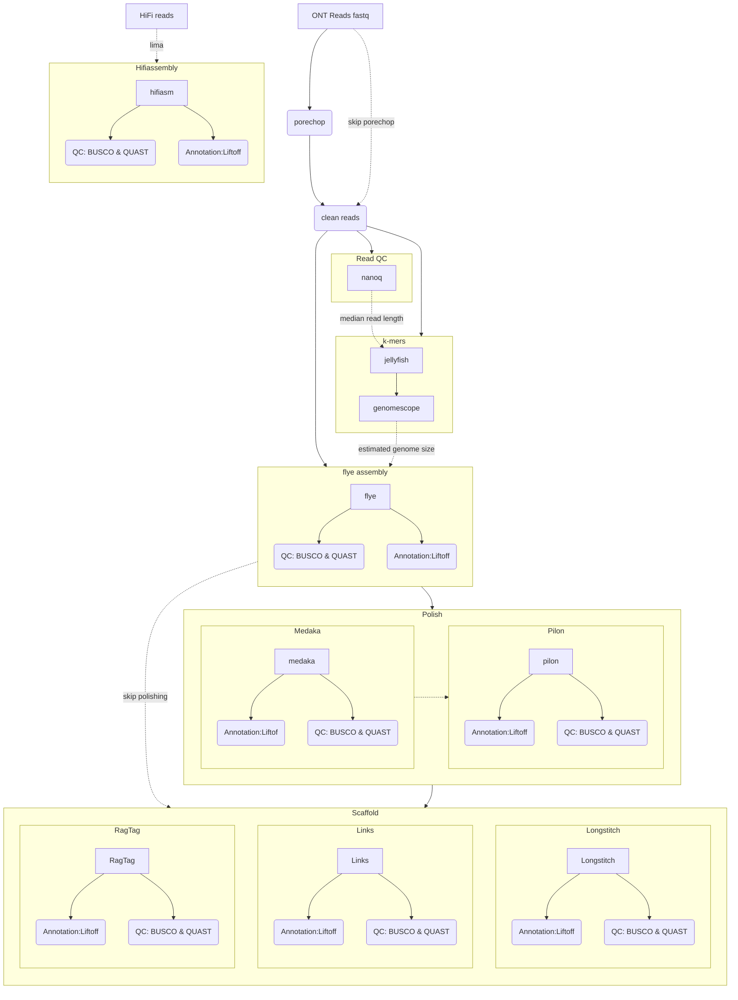

# Graph

```mermaid
graph TD
  hifi[HiFi reads] -. lima .-> Hifiassembly
  fastq[ONT Reads fastq] --> porechop("porechop")
  porechop --> clean_reads(clean reads)
  fastq -. skip porechop .-> clean_reads
  clean_reads --> Readqc
  subgraph k-mers
  direction TB
  jellyfish --> genomescope
  end
  subgraph Readqc[Read QC]
  nanoq
  end
  clean_reads --> k-mers
  nanoq -. median read length .-> jellyfish
  clean_reads --> Assembly
  subgraph Assembly[flye assembly]
  direction TB
  assembler[flye]
  assembler --> asqc(QC: BUSCO & QUAST)
  assembler --> asliftoff(Annotation:Liftoff)
  end
  subgraph Hifiassembly
  direction TB
  assembler2[hifiasm]
  assembler2 --> asqc2(QC: BUSCO & QUAST)
  assembler2 --> asliftoff2(Annotation:Liftoff)
  end
  genomescope -. estimated genome size .-> Assembly
  subgraph Polish
  direction LR
  subgraph Medaka
  medaka[medaka] 
  medaka --> meliftoff(Annotation:Liftof)
  medaka --> meqc(QC: BUSCO & QUAST)
  end
  subgraph Pilon
  pilon[pilon] 
  pilon --> piliftoff(Annotation:Liftoff)
  pilon --> piqc(QC: BUSCO & QUAST)
  end
  Medaka -.-> Pilon
  end
  Assembly --> Polish
  subgraph Scaffold
  direction TB
  Longstitch
  Links
  RagTag
  end
  subgraph Longstitch
  direction TB
  longstitch[Longstitch] --> lsliftoff(Annotation:Liftoff)
  longstitch --> lsQC(QC: BUSCO & QUAST)
  end
  subgraph Links
  direction TB
  links[Links] --> liliftoff(Annotation:Liftoff)
  links --> liQC(QC: BUSCO & QUAST)
  end
  subgraph RagTag
  direction TB
  ragtag[RagTag] --> raliftoff(Annotation:Liftoff)
  ragtag --> raQC(QC: BUSCO & QUAST)
  end
  Assembly -. skip polishing .-> Scaffold
  Polish --> Scaffold
```